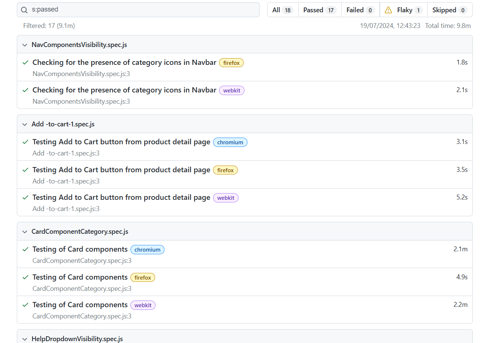

# Jumia-test-automation

This project is a Playwright testing suite designed to validate the functionality and visibility of various components in Jumia web application across different browsers. The suite includes tests for the Navbar, Add to Cart button, Card components, Help dropdown icons, Product testing, and Search button.

## Screenshot Samples



## Table of Contents

- [Installation](#installation)
- [Project Structure](#project-structure)
- [Running Tests](#running-tests)
- [Test Descriptions](#test-descriptions)
- [Contributing](#contributing)
- [License](#license)

## Installation

To get started, clone the repository and install the necessary dependencies:

```bash
git clone https://github.com/KwyTechDev/Jumia-test-automation.git
cd Jumia-test-automation
npm install
```

## Project Structure

```plaintext
Jumia-test-automation/
├── Jumia-tests/
│   ├── NavComponentsVisibility.spec.js
│   ├── Add-to-cart-1.spec.js
│   ├── CardComponentCategory.spec.js
│   ├── HelpDropdownVisibility.spec.js
│   ├── ProductTesting.spec.js
│   └── Search-SearchButton.spec.js
├── .gitignore
├── package.json
├── playwright.config.js
└── README.md
```

- **tests/**: Directory containing all the test specifications.
- **.gitignore**: Git ignore file.
- **package.json**: Project metadata and dependencies.
- **playwright.config.js**: Configuration file for Playwright.
- **README.md**: This README file.

## Running Tests

To run the tests, use the following command:

```bash
npx playwright test
```

You can specify a particular browser to run the tests:

```bash
npx playwright test --project=chromium
npx playwright test --project=firefox
npx playwright test --project=webkit
```

## Test Descriptions

### NavComponentsVisibility.spec.js

- **Description**: Checks for the presence of category icons in the Navbar.
- **Browsers**: Firefox, Webkit

### Add-to-cart-1.spec.js

- **Description**: Tests the Add to Cart button from the product detail page.
- **Browsers**: Chromium, Firefox, Webkit

### CardComponentCategory.spec.js

- **Description**: Tests the Card components.
- **Browsers**: Chromium, Firefox, Webkit

### HelpDropdownVisibility.spec.js

- **Description**: Checks for the visibility of the icons in the help dropdown.
- **Browsers**: Chromium, Firefox, Webkit

### ProductTesting.spec.js

- **Description**: General product testing.
- **Browsers**: Chromium, Firefox, Webkit

### Search-SearchButton.spec.js

- **Description**: Checks the functionality of the Search and Search button.
- **Browsers**: Chromium, Firefox, Webkit

## Contributing

Contributions are welcome! Please fork the repository and create a pull request with your changes.

## License

This project is licensed under the MIT License. See the [LICENSE](LICENSE) file for more details.

